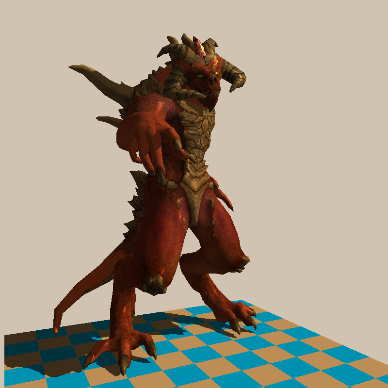
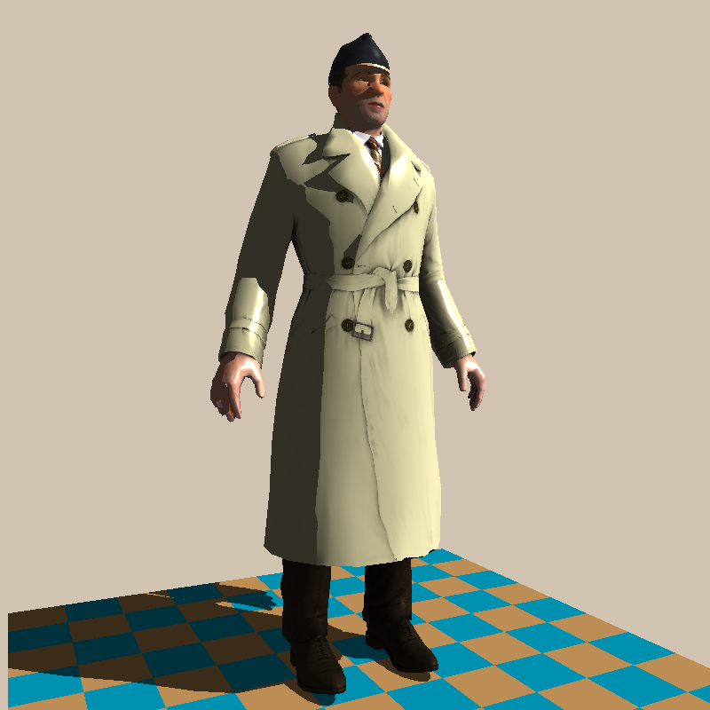

#  TinyRenderer-Homework

感谢[ssloy/tinyrenderer: A brief computer graphics / rendering course](https://github.com/ssloy/tinyrenderer)详尽的教程，本项目在原始项目的基础上修改了部分实现，详细教程请参照[Home - Playing with code](https://haqr.eu/tinyrenderer/)和源码。
## 关于Lesson文件夹

 - 每个文件夹为一个项目，项目之间的代码是逐步增加的，参照课程打开对应的项目即可。
 - 课程文件夹内部的out文件为笔者执行执行当前项目时的结果，难免有疏漏，敬请指正。

## 关于pic_result文件夹
pic_result文件夹为将tga文件转换为png文件之后的结果，已经按照课程顺序整理好，参照本项目的朋友们可以比对。

## 项目结果展示

